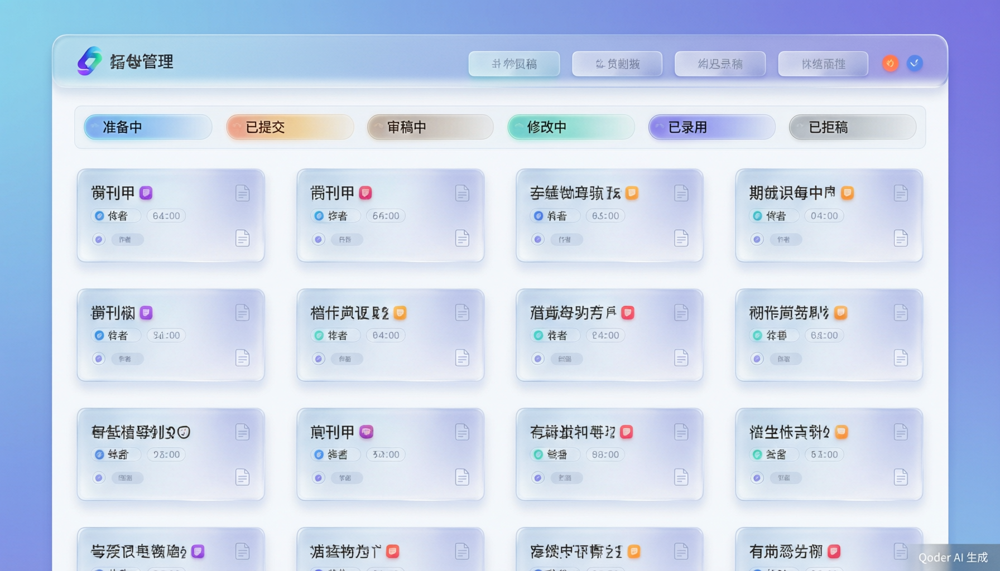
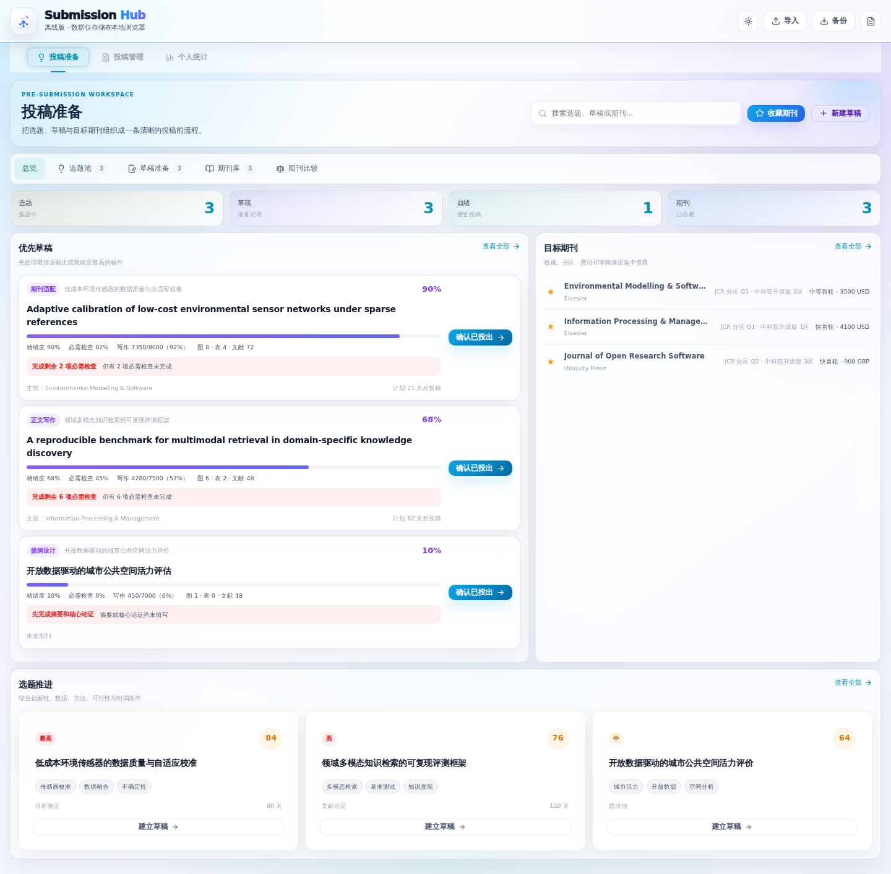
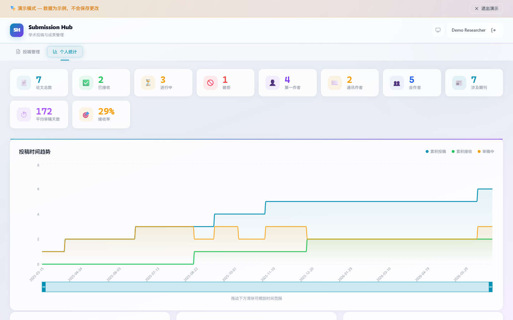
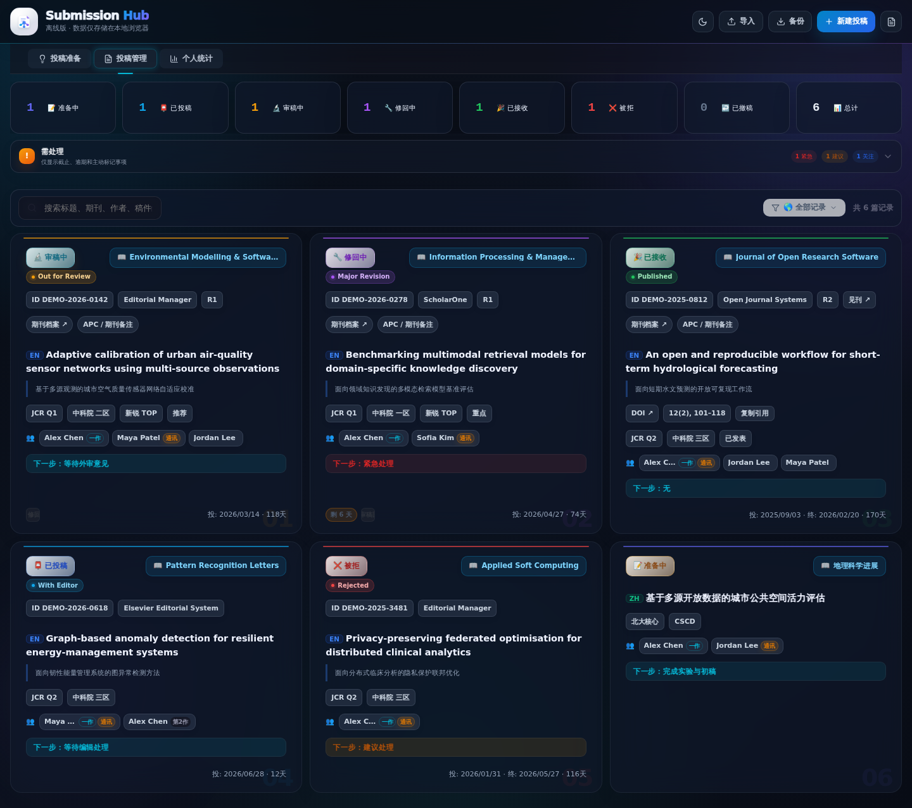
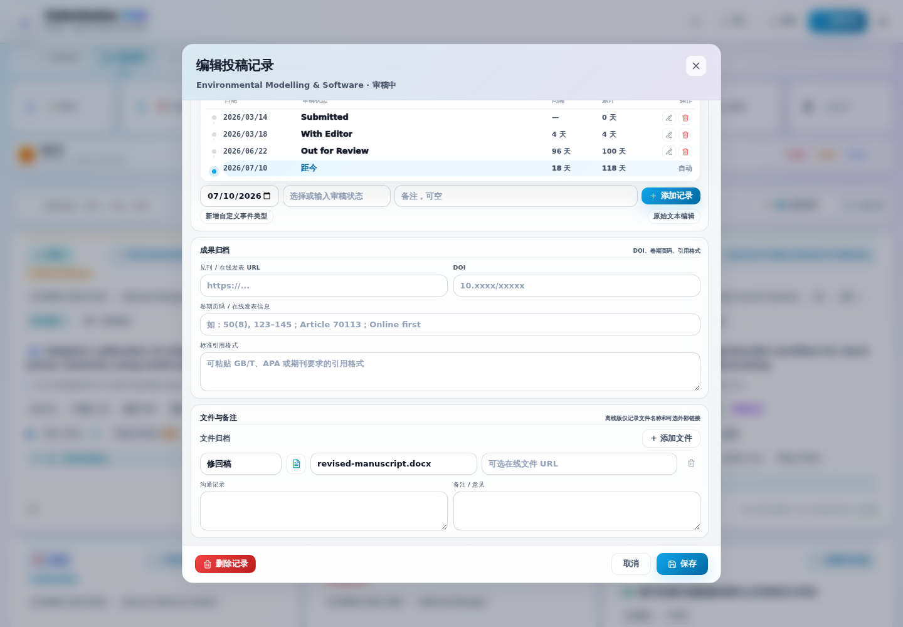
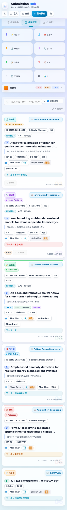

# Submission Hub

<p align="center">
  
</p>

<p align="center">
  
</p>

<p align="center">
  💡 选题准备 · 🏛️ 期刊筛选 · ✍️ 草稿管理 · 🧭 投稿跟踪 · 📚 成果归档
</p>

<p align="center">
  <a href="https://qi-i.github.io/submission-hub/">🌐 在线使用</a> ·
  <a href="https://github.com/Qi-i/submission-hub/releases">📦 离线版下载</a> ·
  <a href="#preview">🖼️ 界面预览</a> ·
  <a href="#features">🚀 功能亮点</a> ·
  <a href="#dev">🧑‍💻 本地开发</a> ·
  <a href="#release">🚢 发布</a>
</p>

<p align="center">
  
  
  
  
</p>

## ✨ 概述

Submission Hub 是一个面向科研论文全流程的轻量管理工具，覆盖选题判断、论文写作准备、目标期刊筛选、投稿材料检查、正式投稿、审稿修回、改投与成果归档。

| 版本 | 使用场景 | 数据位置 | 核心特点 |
|---|---|---|---|
| 🌐 在线版 | 多设备、长期维护、云端同步 | Supabase | GitHub / 邮箱登录、云端保存、跨设备访问 |
| 📦 离线版 | 单机使用、临时记录、本地备份 | 浏览器本地存储 | 单 HTML 文件、无需服务器、不连接 Supabase |

<a id="preview"></a>

## 🖼️ 界面预览

> 以下截图均由虚构示例数据自动生成，不包含真实用户、真实论文、真实稿件编号或个人联系方式。

### 📄 投稿管理



### ✍️ 投稿准备



### 📊 个人统计



### 🌙 暗色模式



### 📝 投稿记录编辑



### 📱 移动端

<p align="center">
  
</p>

<a id="features"></a>

## 🚀 功能亮点

| 模块 | 功能 |
|---|---|
| 💡 研究选题池 | 记录研究问题、文献缺口、创新点、方法、数据来源和计划节点，并从创新性、可行性、数据、方法、时间五方面评分 |
| ✍️ 草稿准备 | 管理摘要、提纲、作者、字数、图表、参考文献、计划投稿日期和协作链接 |
| ✅ 投稿就绪度 | 综合检查清单、摘要、作者、主投期刊和写作进度，自动提示阻碍项与下一步行动 |
| 📊 投稿前仪表盘 | 实时汇总平均就绪度、阻碍项、临近截止、逾期、未选主投期刊和建议下一步，并提供快捷操作 |
| 🧾 投稿前检查 | 内置题名、摘要、作者、图表、数据、伦理、基金、Cover Letter 等检查项，并支持期刊特有的自定义事项 |
| 🏛️ 期刊库 | 收藏官网、作者指南、投稿入口、第三方介绍、ISSN、分区、影响因子、收录、OA、APC、审稿周期、接收率和风险备注 |
| 🎨 自适应期刊分区 | 中文期刊优先展示 EI、北大核心、CSCD、科技核心、CSSCI；英文期刊优先展示新锐、中科院、JCR 与 IF；同时具备两类数据时按实际信息混合显示 |
| ✨ 快速识别期刊 | 可通过 DOI、doi.org 链接或 ISSN 从 Crossref 识别基础信息；在线版在后台密钥配置完成后可查询并缓存期刊等级 |
| 💱 APC 人民币参考价 | 保留原始金额和币种，外币 APC 自动显示约合人民币、汇率日期与缓存状态；期刊卡片、投稿卡片、编辑表单和比较页同步显示 |
| ⚖️ 期刊比较 | 最多并列比较 4 本期刊的质量、费用、速度、开放获取、接收率、收录和风险信息；不同币种 APC 先换算人民币后再阅读，不直接比较原始数字 |
| 🔄 流程衔接 | 选题可一键建立草稿；确认正式投出后自动生成已投稿记录、Submitted 时间线并回写草稿状态，并防止重复转入 |
| 🔁 自动返修轮次 | 根据时间线中的大修、小修、退修、Revision、修回稿提交和再次外审等节点自动识别 R1、R2……；没有可识别记录时保留手工值 |
| 🀄 中文投稿状态 | 识别待分稿、编辑部处理、初审、送外审、专家评审、复审、终审、退修、拟录用、正式录用、退稿和撤稿等常见中文状态，并保留后台原文 |
| 🔐 账户登录 | 支持 GitHub OAuth 与邮箱密码登录；已登录用户可设置密码或绑定 GitHub，使两种方式进入同一账户 |
| 📌 投稿状态 | 准备中、已投稿、审稿中、修回中、已接收、被拒、已撤稿 |
| 🏷️ 审稿子状态 | With Editor、Out for Review、Decision Pending 以及中文投稿后台原文作为主状态下方的次级状态显示 |
| ⚠️ 需处理 | 可折叠辅助区，仅汇总修回截止、逾期、编辑处理偏久和用户主动标记事项；见刊资料不作为待办 |
| ⏱️ 审稿时间线 | 支持中英文状态节点、按日期自动排序、节点间隔、累计天数和距今统计 |
| 📅 距今统计 | 按本地日期计算最后一次状态更新距今天数和首投累计天数 |
| 🔁 版本链 | 支持拒稿、撤稿、改投后的前后版本关联，并阻止循环链 |
| 📚 成果归档 | DOI、见刊链接、卷期页码和引用格式 |
| 👥 作者身份 | 本人、一作、通讯作者识别 |
| 📊 统计分析 | 投稿数量、已决接收率、已决拒稿率、审稿周期和期刊分布 |
| 💾 完整备份 | v3 备份同时包含投稿、期刊、选题和草稿，兼容旧版数组 JSON 与 v2 备份 |
| 🔒 隐私与离线隔离 | CI 自动检查示例数据隐私，并确认离线 HTML 不包含 Supabase、R2、EasyScholar 密钥或外部脚本依赖 |
| 🧪 视觉回归 | Chromium 自动检查页面截图、弹窗滚动、卡片等高、页面边界和状态/期刊胶囊几何一致性 |

## 🎨 v1.4.0 界面与可靠性调整

- 投稿状态与期刊胶囊统一高度；期刊胶囊按内容宽度收缩并保持右对齐。
- 审稿子状态增加状态色圆点、浅色描边与背景，不再挤占期刊名称位置。
- 汇总区、工具栏、投稿卡片、统计页和投稿准备页统一最大宽度与左右边距。
- 在线版与离线版改为共用同一套样式加载顺序，避免旧样式覆盖最终修复。
- 同一行投稿卡片按最高卡片等高，右下角使用低对比度序号水印。
- 编辑投稿记录使用独立滚动区，底部操作栏保持可见。
- 修复 GitHub OAuth 在 GitHub Pages 子路径下的回跳地址，并增加账户绑定与密码设置。
- 恢复期刊等级查询入口，增加缓存提示、无结果提示和登录失效、限流、未配置等错误分类。
- 投稿准备总览增加真实数据驱动的投稿前仪表盘，展示平均就绪度、需处理项目与建议下一步。
- 投稿准备总览中的“收藏期刊”由紧凑文字行升级为更大的信息卡片，扩大展示区域并集中呈现主要分区、核心收录、费用和审稿速度。
- 期刊信息采用多色浅底色块区分新锐、中科院、JCR、IF、EI、北大核心、CSCD、科技核心和 CSSCI，并整体提高字号与字重。
- 期刊分区不再套用单一排序：中文期刊优先核心与数据库收录，英文期刊优先新锐、中科院、JCR 与 IF，混合期刊按实际数据组合展示。
- 期刊库完整卡片和期刊比较页同步使用自适应分区摘要。
- 外币 APC 使用公开日汇率显示人民币参考价，保留原始金额，缓存 24 小时，并在断网时尝试使用最近缓存。
- 返修轮次根据时间线自动重算；中文与英文投稿后台状态均可映射到统一主状态，同时保留原始子状态。
- “拟录用”等非最终状态不会直接归为已接收，避免中文投稿流程被过度判断。
- 草稿转投稿增加并发校验与失败回滚，避免重复或孤立投稿记录。
- 示例截图和测试数据全部替换为虚构内容，并加入自动隐私检查。

<a id="online"></a>

## 🌐 在线版

在线版地址：<https://qi-i.github.io/submission-hub/>

在线版部署在 GitHub Pages，使用 Supabase 提供注册登录、云端保存和跨设备访问。

部署前需要：

1. 在 Supabase SQL Editor 中按编号依次执行 `supabase/001` 至 `supabase/011` 迁移文件。
2. 部署 `admin-stats`、`reset-password`、`r2-upload` 和 `journal-rank` Edge Functions；不使用相应功能时可不部署 R2 上传函数。
3. 配置 GitHub Pages 环境变量 `VITE_SUPABASE_URL`、`VITE_SUPABASE_ANON_KEY` 和 `VITE_ADMIN_ID`。
4. 在 Supabase Auth 的 Redirect URLs 中加入完整地址 `https://qi-i.github.io/submission-hub/`；GitHub OAuth App 的 callback URL 使用 Supabase 提供的 `/auth/v1/callback` 地址。
5. 如需期刊等级查询，在 Supabase Edge Function Secrets 中设置 `EASYSCHOLAR_SECRET_KEY`。该密钥只保存在服务端，不应写入前端代码、日志、截图或 GitHub 仓库。

APC 人民币换算使用 Frankfurter 公共日汇率接口，不需要密钥。请求只包含币种代码，不发送论文题名、作者、稿件编号、账户或 Supabase 数据；换算结果仅作参考，不会覆盖原始 APC。

`008_preparation_workspace.sql` 创建期刊库、研究选题和草稿准备三张表；`009_preparation_performance.sql` 补充草稿转投稿关联索引；`010_journal_rank_cache.sql` 增加期刊等级快照、缓存和服务端限流；`011_external_api_hardening.sql` 为缓存与限流表增加显式拒绝策略并清理无用索引。

<a id="offline"></a>

## 📦 离线版

离线版下载：<https://github.com/Qi-i/submission-hub/releases>

Release 附件文件名为 `submission-hub-offline.html`。下载后直接用浏览器打开即可使用。

离线版不包含登录、Supabase 云同步、EasyScholar 密钥和 R2 上传。投稿记录、期刊库、选题、草稿和个人设置均保存在当前浏览器本地存储中。DOI / ISSN 基础识别和首次外币 APC 换算属于可选联网功能；汇率成功获取后缓存 24 小时，断网时可继续使用最近一次缓存，其余本地管理功能不受影响。

<a id="dev"></a>

## 🧑‍💻 本地开发

```bash
npm ci
npm run dev
```

分别构建在线版与离线版：

```bash
npm run build
npm run build:offline
```

执行完整验证：

```bash
npm run verify
```

`verify` 会依次完成示例数据隐私检查、在线版构建、离线版构建和离线包隔离检查。

## 🧱 技术栈

React 18 · TypeScript · Vite · Supabase · Recharts · Lucide React · vite-plugin-singlefile · GitHub Pages · GitHub Actions · Playwright

<a id="release"></a>

## 🚢 发布

| 发布对象 | Workflow | 触发方式 | 输出 |
|---|---|---|---|
| 🌐 在线版 | Deploy to GitHub Pages | 应用代码变更后自动执行，也可手动运行 | GitHub Pages 站点 |
| 📦 离线版 | Release Offline HTML | 手动运行或版本发布标记 | `submission-hub-offline.html` |
| 🧪 质量检查 | Verify Online and Offline Builds | 应用代码变更和 Pull Request | 隐私检查、在线构建、离线构建与隔离检查 |
| 🖼️ 视觉回归 | Capture Visual Review | 主分支代码变更、Pull Request 或手动运行 | 桌面、暗色、移动端、弹窗和几何检查产物 |
| 📸 文档截图 | Update Documentation Screenshots | 手动运行或截图刷新标记 | 使用虚构数据更新 README 截图 |

## 🏷️ 版本

当前版本：`v1.4.0`

## 📄 License

MIT
