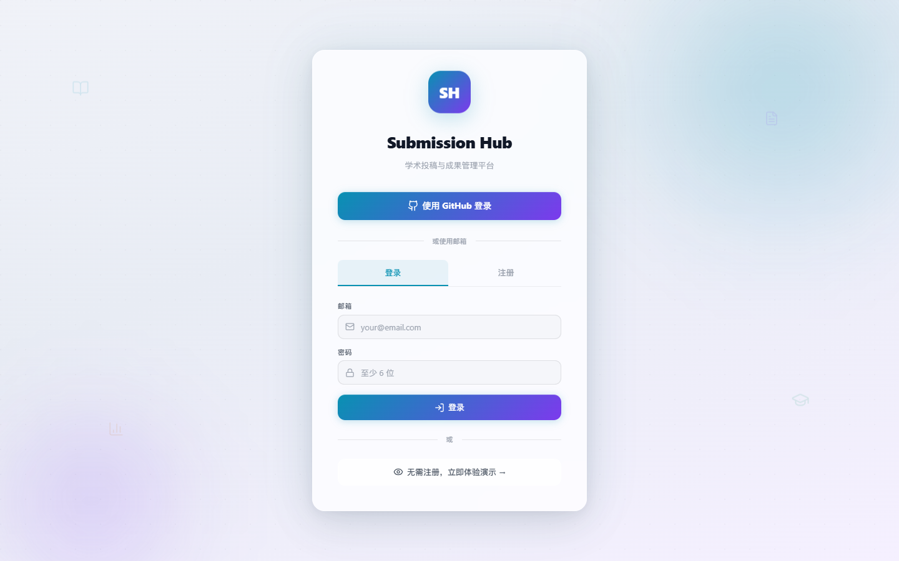

# Submission Hub

<p align="center">
  
</p>

<p align="center">
  <strong>Submission Hub</strong><br />
  学术投稿、审稿时间线、版本链与成果归档管理平台
</p>

<p align="center">
  <a href="https://qi-i.github.io/submission-hub/">在线使用</a> ·
  <a href="https://github.com/Qi-i/submission-hub/releases">离线版下载</a> ·
  <a href="CHANGELOG.md">更新日志</a>
</p>

## 概述

Submission Hub 是一个面向科研论文投稿流程的轻量管理工具，用于记录论文从准备、投稿、审稿、修回、接收、拒稿、改投到成果归档的全过程。

项目提供两种使用方式：

- **在线版**：部署在 GitHub Pages，使用 Supabase 进行登录认证和云端数据同步，适合多设备使用。
- **离线版**：以单个 HTML 文件发布到 GitHub Releases，去除登录和云端同步能力，数据仅保存在本地浏览器。

## 界面预览

### 登录页面



### 投稿管理


### 个人统计


## 功能

- 投稿状态管理：准备中、已投稿、审稿中、修回中、已接收、被拒、已撤稿。
- 审稿时间线：记录 Submitted、With Editor、Out for Review、Decision Pending、Revision 等节点。
- 距今统计：仍在审稿流程中时，自动计算最后一次状态更新距今天数和首投累计天数。
- 版本链追踪：支持拒稿、撤稿、改投后的版本关联。
- 成果归档：记录 DOI、见刊链接、卷期页码和引用格式。
- 期刊信息复用：保存期刊官网、投稿系统、APC 和备注信息。
- 作者身份识别：识别本人、一作、通讯作者，并用于个人统计。
- 个人统计：统计投稿数量、接收率、拒稿率、审稿周期、期刊分布等指标。
- 数据导入导出：支持 JSON 备份和迁移。

## 在线版与离线版

### 在线版

在线版入口：

https://qi-i.github.io/submission-hub/

在线版依赖 Supabase，支持注册登录、云端保存、跨设备访问和多人使用。

### 离线版

离线版在 GitHub Releases 中发布，附件文件名为：

```text
submission-hub-offline.html
```

下载后直接用浏览器打开即可使用。离线版不连接 Supabase，不提供登录和云同步，所有数据保存在浏览器本地存储中。

## 本地开发

安装依赖：

```bash
npm install
```

启动开发环境：

```bash
npm run dev
```

构建在线版：

```bash
npm run build
```

构建离线版：

```bash
npm run build:offline
```

离线版构建产物位于：

```text
dist-offline/offline.html
```

## 环境变量

在线版需要配置 Supabase：

```env
VITE_SUPABASE_URL=你的 Supabase 项目 URL
VITE_SUPABASE_ANON_KEY=你的 Supabase 匿名 key
```

离线版不需要 Supabase 环境变量。

## 技术栈

- React 18
- TypeScript
- Vite
- Supabase
- Recharts
- Lucide React
- vite-plugin-singlefile
- GitHub Pages
- GitHub Actions

## 主要目录

```text
src/
├── components/
│   ├── Dashboard.tsx          # 在线版主界面
│   ├── OfflineDashboard.tsx   # 离线版主界面
│   ├── Login.tsx              # 登录页面
│   ├── PaperCard.tsx          # 投稿卡片
│   ├── PaperForm.tsx          # 投稿记录表单
│   ├── Timeline.tsx           # 审稿时间线
│   ├── PersonalStats.tsx      # 个人统计
│   └── AdminPanel.tsx         # 后台管理
├── lib/
│   ├── supabase.ts            # Supabase 客户端
│   ├── auth.tsx               # 认证上下文
│   ├── theme.tsx              # 主题上下文
│   ├── types.ts               # 类型、状态和推断规则
│   ├── local-store.ts         # 离线版本地存储
│   └── demo-data.ts           # 演示数据
├── main.tsx                   # 在线版入口
└── offline.tsx                # 离线版入口

public/
├── logo.svg
└── favicon.svg
```

## 发布

在线版由 `Deploy to GitHub Pages` workflow 自动部署。

离线版由 `Release Offline HTML` workflow 构建，并作为 Release 附件发布。

## 版本

当前版本：`v1.1.0`

完整变更见 [CHANGELOG.md](CHANGELOG.md)。

## License

MIT
