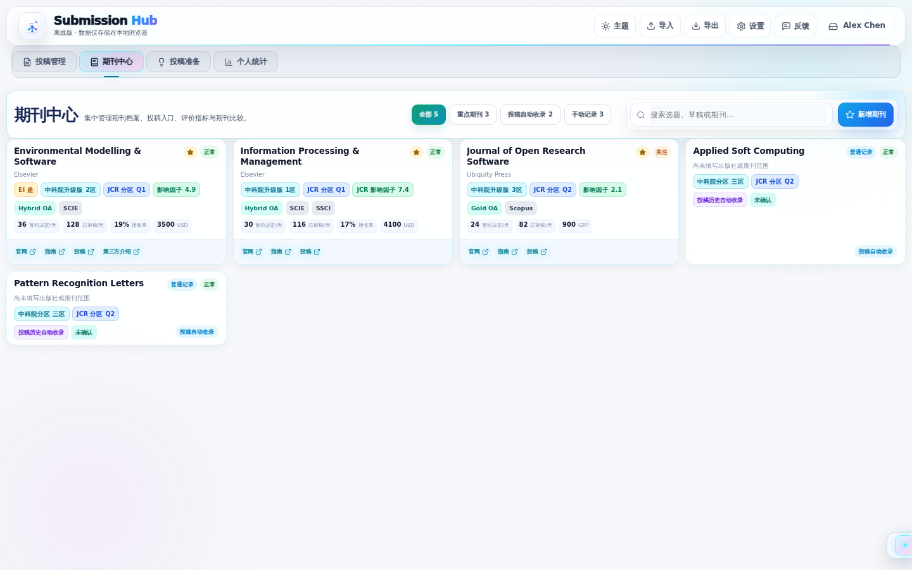
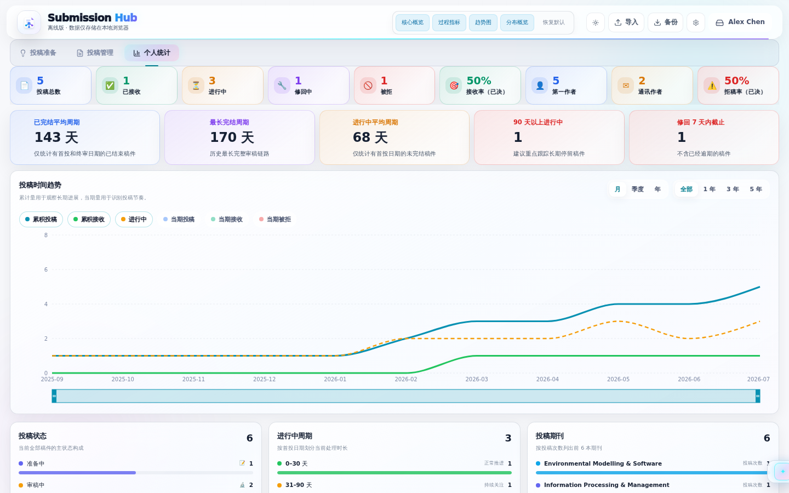
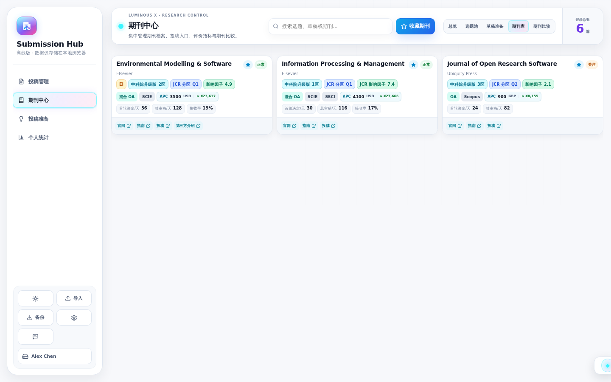
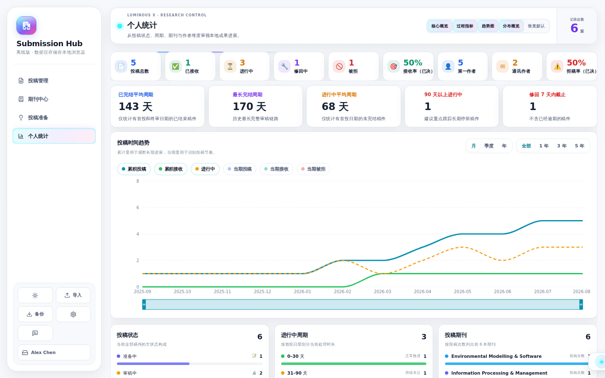
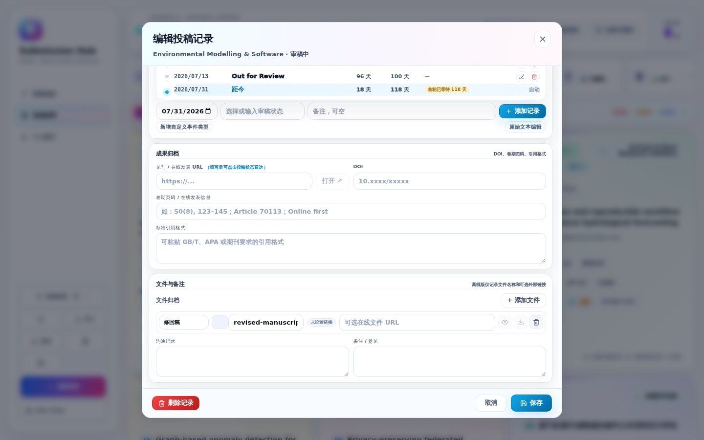
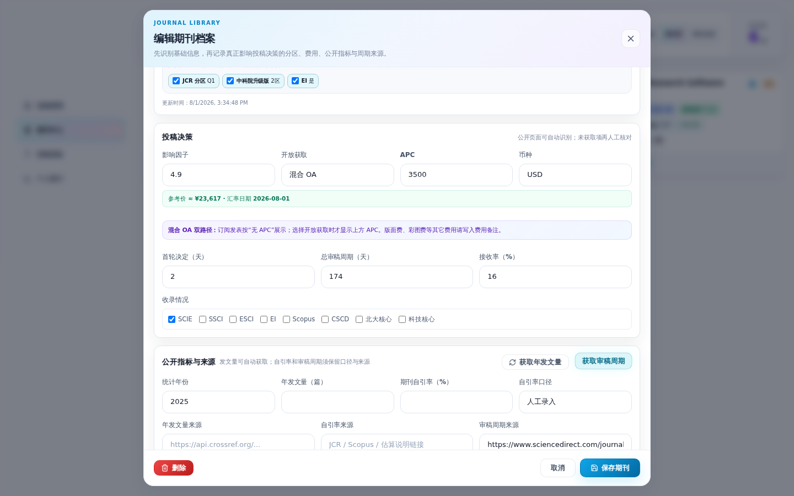

# Submission Hub

<p align="center">
  
</p>

<p align="center">
  
</p>

<p align="center">
  💡 选题准备 · 🏛️ 期刊筛选 · ✍️ 草稿管理 · 🧭 投稿跟踪 · 📚 成果归档
</p>

<p align="center">
  <a href="https://qi-i.github.io/submission-hub/">🌐 在线使用</a> ·
  <a href="https://github.com/Qi-i/submission-hub/releases/latest">📦 离线版下载</a> ·
  <a href="#interfaces">🖼️ 双界面预览</a> ·
  <a href="#usage">📘 使用方法</a> ·
  <a href="docs/releases/v1.5.0.md">📋 v1.5.0 更新说明</a>
</p>

<p align="center">
  
  
  
  
</p>

## 项目定位

Submission Hub 用于管理科研论文从选题到见刊的完整过程：

**研究选题 → 草稿准备 → 目标期刊筛选 → 投稿材料检查 → 正式投稿 → 审稿与修回 → 改投 → 录用与成果归档**

| 版本 | 数据位置 | 使用方式 |
|---|---|---|
| 在线版 | Supabase 云端 | GitHub 或邮箱登录，多设备同步，私有附件存储 |
| 离线版 | 当前浏览器本地存储 | 下载单 HTML 文件，直接打开，手动导入导出备份 |

<a id="interfaces"></a>

## 双界面

Luminous 与 Luminous X 使用同一套数据、功能和业务逻辑。界面切换按钮位于页面右侧边缘，选择结果保存在账户偏好中。

| 界面 | 布局特点 | 适用方式 |
|---|---|---|
| **Luminous** | 顶部导航、横向页面结构、信息密度紧凑 | 传统网页操作习惯，快速切换四个主页面 |
| **Luminous X** | 固定左侧栏、顶部状态控制区、工作流视图更突出 | 长时间管理多篇稿件，强调状态扫描与集中操作 |

所有桌面截图统一使用 **1440 × 900** 画布并按单张通栏展示；移动端截图使用 **390 × 700** 画布并单独展示。

### Luminous

#### 投稿管理


#### 投稿准备


#### 期刊库



#### 个人统计



### Luminous X

#### 投稿管理


#### 投稿准备


#### 期刊库



#### 个人统计



### 其他界面

#### 暗色模式


#### 投稿记录编辑



#### 期刊资料与公开审稿指标



#### 移动端

<p align="center">
  
</p>

> 所有文档截图由自动视觉测试使用虚构数据生成，不包含真实用户、论文题名、稿件编号、邮箱或附件内容。

<a id="usage"></a>

## 使用方法

### 在线版快速开始

1. 打开 <https://qi-i.github.io/submission-hub/>。
2. 使用 GitHub 或邮箱登录。
3. 在页面右侧边缘选择 **Luminous** 或 **Luminous X**，再选择亮色或暗色。
4. 打开“投稿准备”，从研究选题池建立选题记录。
5. 将选题转为草稿，补充摘要、提纲、作者、图表、参考文献和投稿前检查项。
6. 在期刊库收藏目标期刊，填写中文名、缩写、简介翻译、分区、OA、APC、审稿周期、选刊标签和备注。
7. 在期刊比较中并列核对质量、费用、速度、收录和风险信息，确定主投期刊。
8. 正式投出后将草稿转入投稿管理，系统建立 Submitted 时间线并回写草稿状态。
9. 每次状态变化都在投稿记录中新增时间线节点，并更新后台原始状态、截止日期、附件和下一步。
10. 录用后填写 DOI、见刊链接、卷期页码和引用格式，归档录用通知、校样、检索证明和见刊文件。

### 离线版快速开始

1. 打开 <https://github.com/Qi-i/submission-hub/releases/latest>。
2. 下载 `submission-hub-offline.html`。
3. 用 Chrome、Edge 或 Firefox 打开文件。
4. 在离线工作区建立投稿、期刊、选题和草稿记录。
5. 定期使用“导出备份”保存 JSON 文件。
6. 在其他浏览器中使用“导入备份”恢复全部数据。

### 日常维护顺序

| 阶段 | 主要页面 | 记录内容 |
|---|---|---|
| 选题论证 | 投稿准备 → 研究选题池 | 研究问题、文献缺口、创新点、数据、方法和计划节点 |
| 论文写作 | 投稿准备 → 草稿准备 | 摘要、提纲、作者、图表、参考文献、协作链接和检查项 |
| 期刊决策 | 投稿准备 → 期刊库 / 期刊比较 | 双语期刊资料、分区、收录、OA、APC、速度、标签和风险 |
| 正式投稿 | 投稿管理 | 投稿日期、稿件编号、后台状态、期刊入口和投稿文件 |
| 审稿修回 | 投稿管理 → 时间线 | 外审节点、决定日期、修回截止、回复信和修回稿 |
| 录用见刊 | 投稿管理 → 成果归档 | DOI、出版链接、卷期页码、引用格式和归档文件 |

## 核心功能

| 模块 | 功能 |
|---|---|
| 研究选题池 | 记录研究问题、文献缺口、创新点、方法、数据来源和计划节点，并进行多维评分 |
| 草稿准备 | 管理摘要、提纲、作者、字数、图表、参考文献、计划投稿日期和协作链接 |
| 投稿就绪度 | 综合检查摘要、作者、主投期刊、写作进度和投稿材料，生成阻碍项与下一步 |
| 期刊库 | 管理官网、作者指南、投稿入口、ISSN、分区、影响因子、收录、OA、APC、审稿周期、接收率和自引率 |
| 双语期刊资料 | 保存英文名、中文名、缩写、英文简介、中文简介翻译、选刊标签和选刊备注 |
| 卡片外显 | 独立控制 EasyScholar 标签，中文名优先显示，缩写按简洁识别原则显示 |
| 审稿指标读取 | 从公开页面读取首轮决定、投稿至接收周期和接收率，并保存来源地址 |
| 期刊比较 | 并列比较四本期刊的质量、费用、速度、开放获取、收录、双语资料和风险信息 |
| 投稿管理 | 工作流、看板和按期刊三种视图统一管理主状态、后台原文、作者、时长和下一步 |
| 审稿时间线 | 自动排序中英文状态节点，计算节点间隔、累计天数和最后更新距今 |
| 返修轮次 | 根据大修、小修、退修、修回稿提交和再次外审节点识别 R1、R2 等轮次 |
| 私有附件 | R2 主存储与 Supabase Storage 回退存储共同完成上传、预览、替换、删除和清理 |
| 成果归档 | 管理 DOI、见刊链接、卷期页码、引用格式、检索证明和见刊文件 |
| 账户资料 | GitHub 与邮箱身份关联，显示名、头像、界面、主题和引导状态同步 |
| 完整备份 | v3 JSON 同时包含投稿、期刊、选题和草稿，并兼容旧版备份 |

## v1.5.0 更新

- 完整保留 Luminous 与 Luminous X，并统一四个主页面的导航、边距、主题和响应式结构。
- 重构投稿准备工作区、草稿推进、期刊收藏、创建入口和最近页面记忆。
- 优化投稿卡片中的期刊名、主状态、后台状态、出版入口、附件和 OA/APC 信息层级。
- 将期刊库压缩为多列高密度卡片，修复长期刊名、未知指标、重复链接、弹窗层级和底部链接栏。
- 新增中文期刊名、缩写、中文简介翻译、选刊标签、选刊备注和卡片外显控制。
- 新增公开审稿指标读取，覆盖 Elsevier Insights 页面、首轮决定、投稿至接收周期和接收率。
- 完善混合 OA、APC 原币与人民币参考价、年发文量、自引率和来源口径。
- 完善 GitHub / 邮箱身份关联、个人资料、头像、登录回跳和多设备偏好同步。
- 将附件升级为私有存储，并完成浏览器内预览、替换、删除和生命周期清理。
- 建立双界面文档截图、隐私检查、在线与离线构建、移动端和弹窗视觉回归。

完整记录见 [docs/releases/v1.5.0.md](docs/releases/v1.5.0.md)。

## 本地开发

```bash
npm ci
npm run dev
```

构建与验证：

```bash
npm run build
npm run build:offline
npm run verify
```

`npm run verify` 依次执行示例数据隐私检查、期刊字段契约、期刊卡片外显规则、在线构建、离线构建和离线隔离检查。

## 在线部署

1. 在 Supabase SQL Editor 中按编号执行 `supabase/001` 至 `supabase/012`。
2. 部署 `admin-stats`、`reset-password`、`r2-upload` 和 `journal-rank` Edge Functions。
3. 在 GitHub Pages 环境中设置 `VITE_SUPABASE_URL`、`VITE_SUPABASE_ANON_KEY` 和 `VITE_ADMIN_ID`。
4. 在 Supabase Auth Redirect URLs 中登记 `https://qi-i.github.io/submission-hub/`。
5. 在 Supabase Edge Function Secrets 中设置 `EASYSCHOLAR_SECRET_KEY`。
6. GitHub Actions 完成构建、Pages 部署和线上 SHA 核验。

## 技术栈

React 18 · TypeScript · Vite · Supabase · Recharts · Lucide React · vite-plugin-singlefile · GitHub Pages · GitHub Actions · Playwright

## 版本

当前版本：`v1.5.0`

## License

MIT
