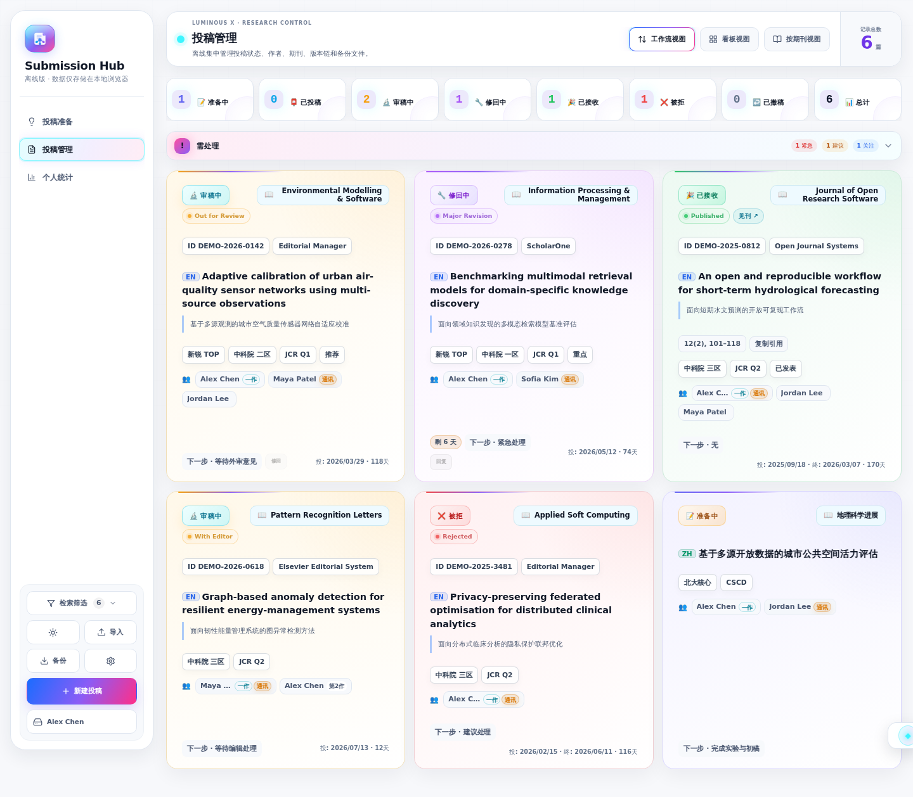
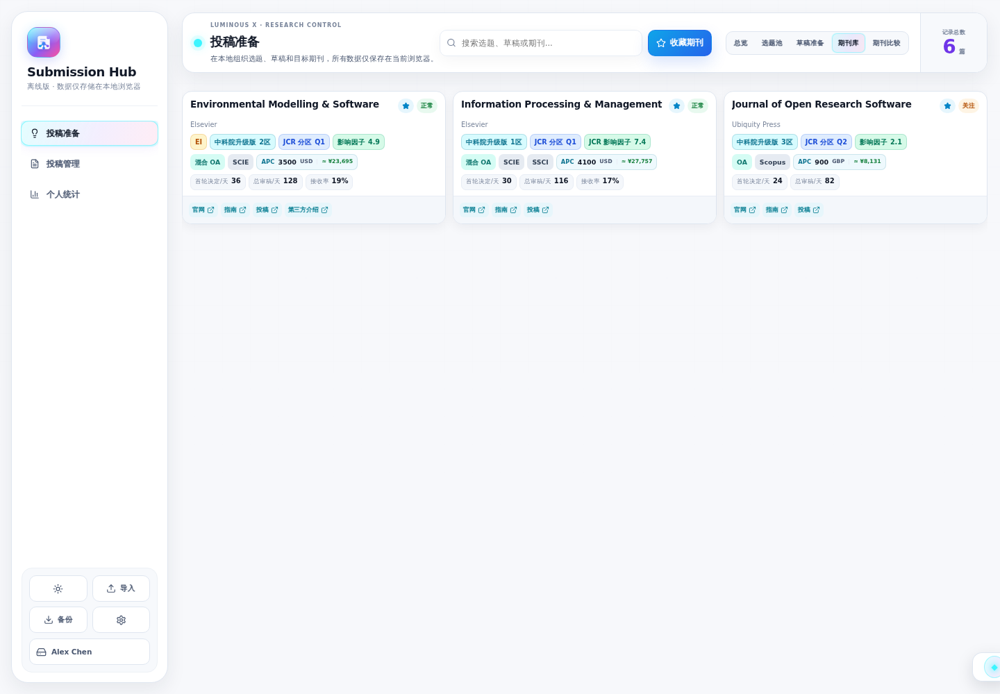
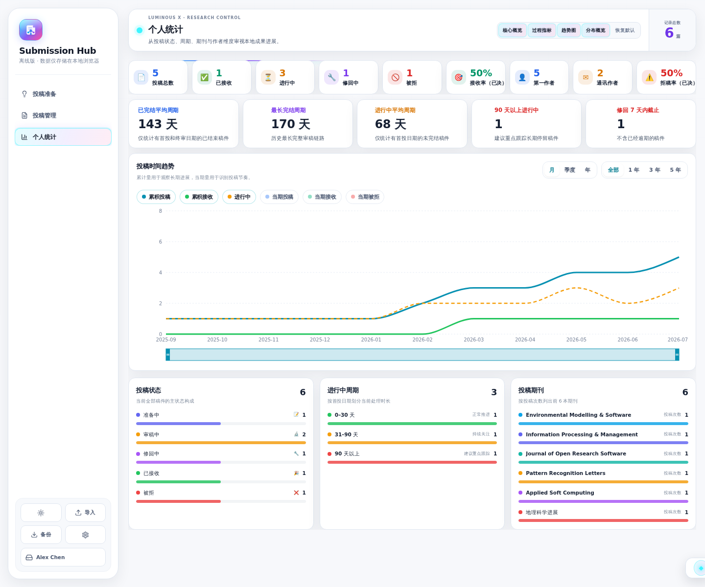
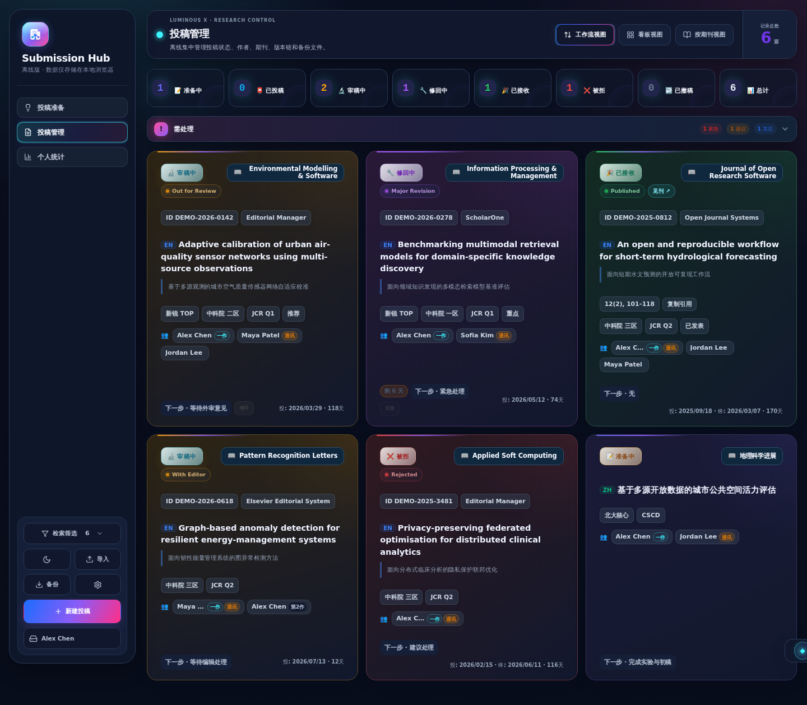
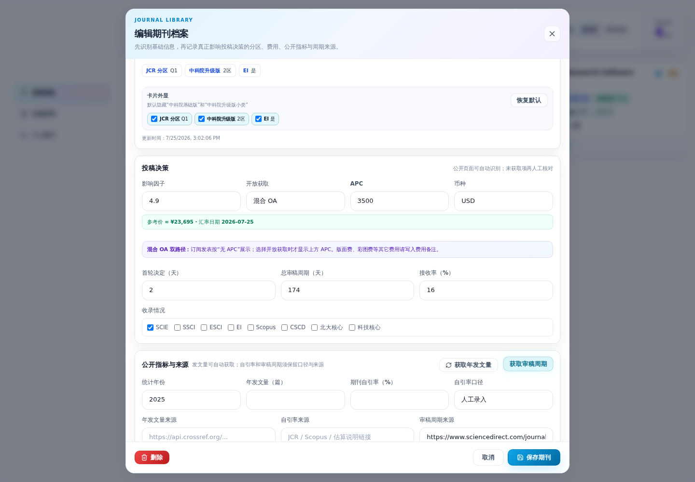
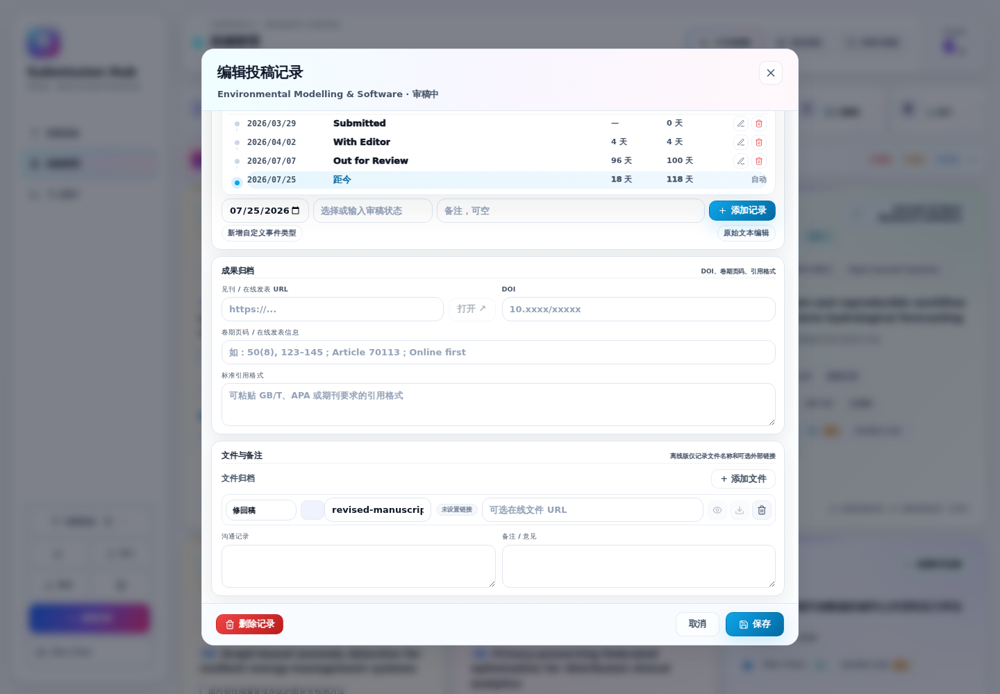
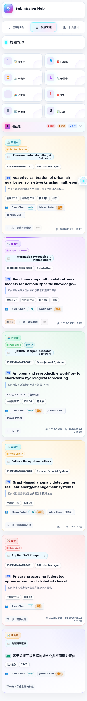

# Submission Hub

<p align="center">
  
</p>

<p align="center">
  
</p>

<p align="center">
  💡 选题准备 · 🏛️ 期刊筛选 · ✍️ 草稿管理 · 🧭 投稿跟踪 · 📚 成果归档
</p>

<p align="center">
  <a href="https://qi-i.github.io/submission-hub/">🌐 在线使用</a> ·
  <a href="https://github.com/Qi-i/submission-hub/releases/latest">📦 离线版下载</a> ·
  <a href="#preview">🖼️ 界面预览</a> ·
  <a href="#features">🚀 功能亮点</a> ·
  <a href="docs/releases/v1.5.0.md">📋 v1.5.0 更新说明</a>
</p>

<p align="center">
  
  
  
  
</p>

## ✨ 概述

Submission Hub 是一个面向科研论文全流程的轻量管理工具，覆盖选题判断、论文写作准备、目标期刊筛选、投稿材料检查、正式投稿、审稿修回、改投与成果归档。

| 版本 | 使用场景 | 数据位置 | 核心特点 |
|---|---|---|---|
| 🌐 在线版 | 多设备、长期维护、云端同步 | Supabase | GitHub / 邮箱登录、云端保存、跨设备访问、私有附件 |
| 📦 离线版 | 单机使用、临时记录、本地备份 | 浏览器本地存储 | 单 HTML 文件、无需服务器、不连接 Supabase |

<a id="preview"></a>

## 🖼️ 界面预览

> 截图由自动视觉测试使用虚构数据生成，不包含真实用户、论文题名、稿件编号或联系方式。当前文档以默认的 Luminous X 界面为主。

### 📄 投稿管理



### 🏛️ 紧凑期刊库



### ✍️ 投稿准备


### 📊 个人统计



### 🌙 暗色模式



### 📝 期刊资料与审稿指标



### 📝 投稿记录编辑



### 📱 移动端

<p align="center">
  
</p>

<a id="features"></a>

## 🚀 功能亮点

| 模块 | 功能 |
|---|---|
| 💡 研究选题池 | 记录研究问题、文献缺口、创新点、方法、数据来源和计划节点，并进行多维评分 |
| ✍️ 草稿准备 | 管理摘要、提纲、作者、字数、图表、参考文献、计划投稿日期和协作链接 |
| ✅ 投稿就绪度 | 综合检查清单、摘要、作者、主投期刊和写作进度，自动提示阻碍项与下一步 |
| 🧭 投稿准备工作区 | 总览、选题池、草稿准备、期刊库和期刊比较统一在高密度工作区，并记忆最近页面与模块状态 |
| 🏛️ 期刊库 | 收藏官网、作者指南、投稿入口、ISSN、分区、影响因子、收录、OA、APC、审稿周期、接收率、自引率和备注 |
| 🌐 双语期刊资料 | 分别保存英文名、中文名、缩写、英文简介、中文简介翻译、选刊标签和选刊备注 |
| 🏷️ 自定义卡片外显 | EasyScholar 标签可按期刊选择是否显示；中文名优先突出，缩写仅显示简洁、可识别形式 |
| 🔎 公开审稿指标 | 从期刊官网或指定来源读取首轮决定、总审稿周期和接收率，并保留来源供人工核验 |
| 🔗 期刊数据互通 | 投稿记录与期刊库按规范化名称关联，投稿卡片和编辑表单可读取最新期刊资料 |
| 💱 OA / APC | 混合 OA 分开显示订阅与开放获取路径；保留原币金额并提供人民币参考价和汇率日期 |
| ⚖️ 期刊比较 | 最多并列比较 4 本期刊的质量、费用、速度、开放获取、收录、双语资料和风险信息 |
| 📌 投稿管理 | 支持工作流、看板和按期刊视图；清晰展示状态、后台原文、期刊、作者、时长和下一步 |
| 🔁 自动返修轮次 | 根据时间线中的大修、小修、退修、Revision、修回稿提交和再次外审识别 R1、R2…… |
| 🀄 中文投稿状态 | 识别编辑处理、送外审、专家评审、退修、终审、拟录用、正式录用、退稿和撤稿等状态 |
| ⏱️ 审稿时间线 | 中英文节点自动排序，计算节点间隔、累计天数、最后更新距今和首投累计天数 |
| 📚 成果归档 | 保存 DOI、见刊链接、卷期页码、引用格式、检索证明和见刊文件 |
| 📎 私有附件 | 在线版使用私有对象存储，支持 PDF、图片、Office 和文本文件预览、替换、删除与清理 |
| 🔐 账户与资料 | GitHub OAuth 与邮箱登录可进入同一账户，支持身份绑定、密码设置、显示名和头像管理 |
| 🎛️ 双界面 | Luminous 与 Luminous X 共用业务逻辑、数据结构和在线/离线能力，支持亮色、暗色与移动端 |
| 💾 完整备份 | v3 备份包含投稿、期刊、选题和草稿，并兼容旧版数据 |
| 🔒 隐私与离线隔离 | CI 检查示例数据隐私，并确认离线 HTML 不包含云端配置或外部脚本依赖 |
| 🧪 自动验证 | 覆盖类型检查、在线/离线构建、期刊字段契约、卡片外显规则、页面几何、暗色、移动端和弹窗滚动 |

## 🎨 v1.5.0 主要更新

- 保留 Luminous 与 Luminous X 两套界面，移除旧 Classic 入口，统一导航、主题和响应式布局。
- 投稿准备支持工作区记忆、紧凑草稿推进、收藏期刊、创建入口和跨页面一致布局。
- 投稿卡片优化期刊名、主状态、后台状态、出版入口、附件标识及 OA/APC 信息密度。
- 期刊库改为紧凑多列卡片，修复长期刊名、未知指标占位、重复链接和弹窗层级。
- 新增中文期刊名、缩写、中文简介翻译、选刊标签与备注，并支持自定义卡片外显。
- 新增公开审稿指标获取，并完善混合 OA、APC、年发文量、自引率和来源口径。
- 完善 GitHub / 邮箱身份关联、个人资料、头像、回跳反馈和多设备偏好同步。
- 附件升级为私有存储，支持浏览器内预览、替换、删除和生命周期清理。
- 更新自动视觉回归与文档截图，覆盖亮色、暗色、移动端和编辑弹窗。

完整变更记录见 [v1.5.0 更新说明](docs/releases/v1.5.0.md)。

## 🌐 在线版

在线版地址：<https://qi-i.github.io/submission-hub/>

在线版部署在 GitHub Pages，使用 Supabase 提供登录、云端保存、跨设备访问和私有附件管理。数据库迁移按 `supabase/001` 至 `supabase/012` 顺序执行。

## 📦 离线版

离线版下载：<https://github.com/Qi-i/submission-hub/releases/latest>

Release 附件文件名为 `submission-hub-offline.html`。下载后可直接用浏览器打开。离线版不包含账户登录或云同步，投稿、期刊、选题、草稿和设置保存在当前浏览器本地存储。

<a id="dev"></a>

## 🧑‍💻 本地开发

```bash
npm ci
npm run dev
```

构建与验证：

```bash
npm run build
npm run build:offline
npm run verify
```

`verify` 会执行示例数据隐私检查、期刊字段契约、期刊卡片外显规则、在线构建、离线构建和离线隔离检查。

## 🧱 技术栈

React 18 · TypeScript · Vite · Supabase · Recharts · Lucide React · vite-plugin-singlefile · GitHub Pages · GitHub Actions · Playwright

## 🚢 发布与质量检查

| 发布对象 | Workflow | 输出 |
|---|---|---|
| 🌐 在线版 | Deploy to GitHub Pages | GitHub Pages 站点与线上 SHA 核验 |
| 📦 离线版 | Release Offline HTML | `submission-hub-offline.html` |
| 🧪 质量检查 | Check / Verify Online and Offline Builds | 隐私、类型、在线/离线构建与隔离检查 |
| 🖼️ 视觉回归 | Capture Visual Review | 两套界面、亮暗色、移动端、弹窗和几何检查产物 |
| 📸 文档截图 | Update Documentation Screenshots | 使用虚构数据更新 README 截图 |

## 🏷️ 版本

当前版本：`v1.5.0`

## 📄 License

MIT
