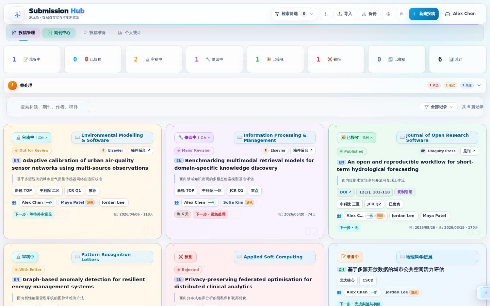
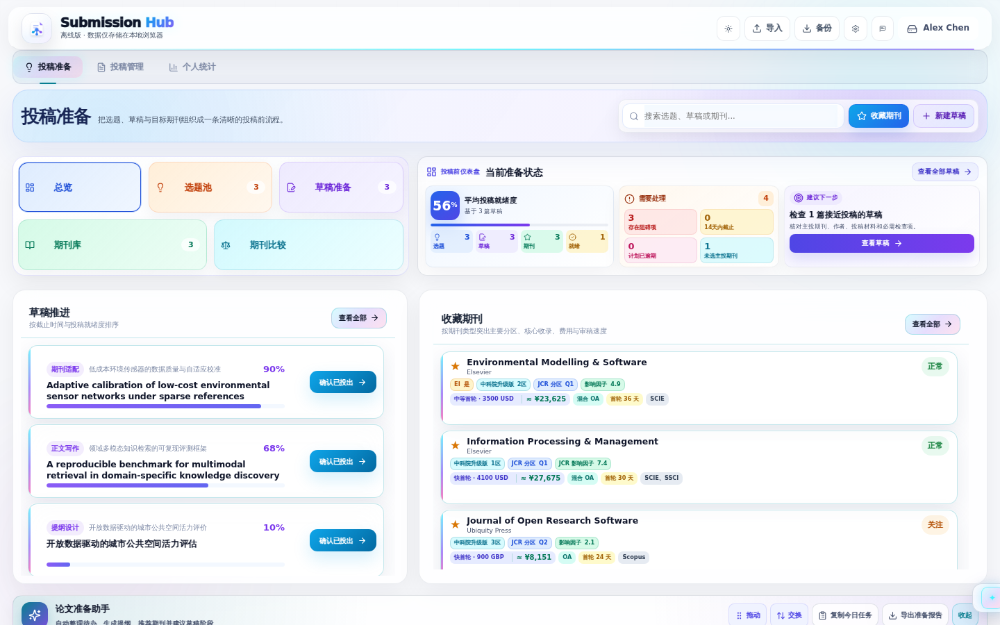
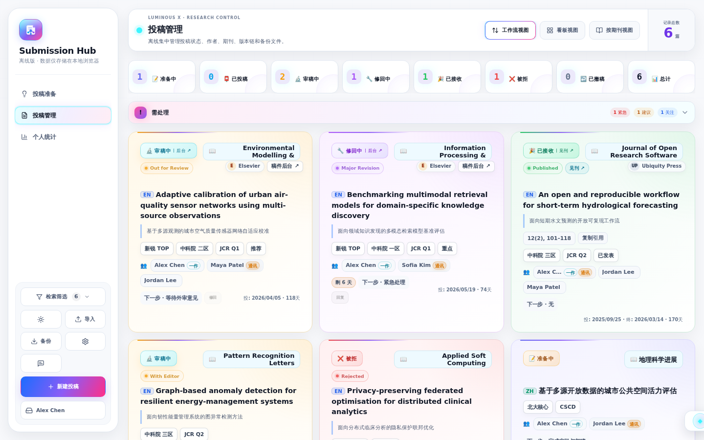
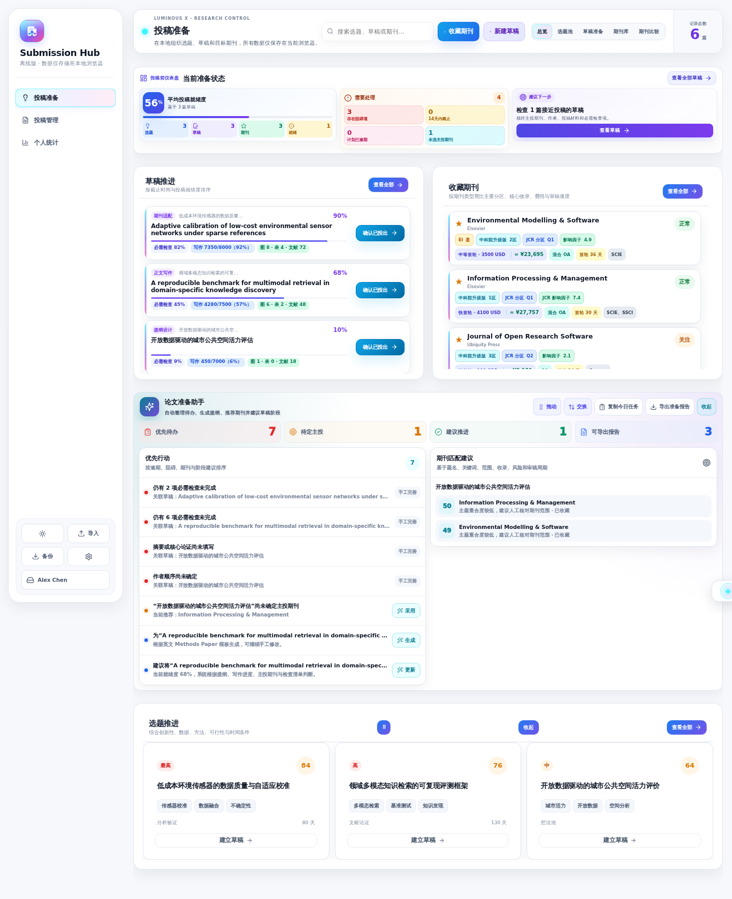
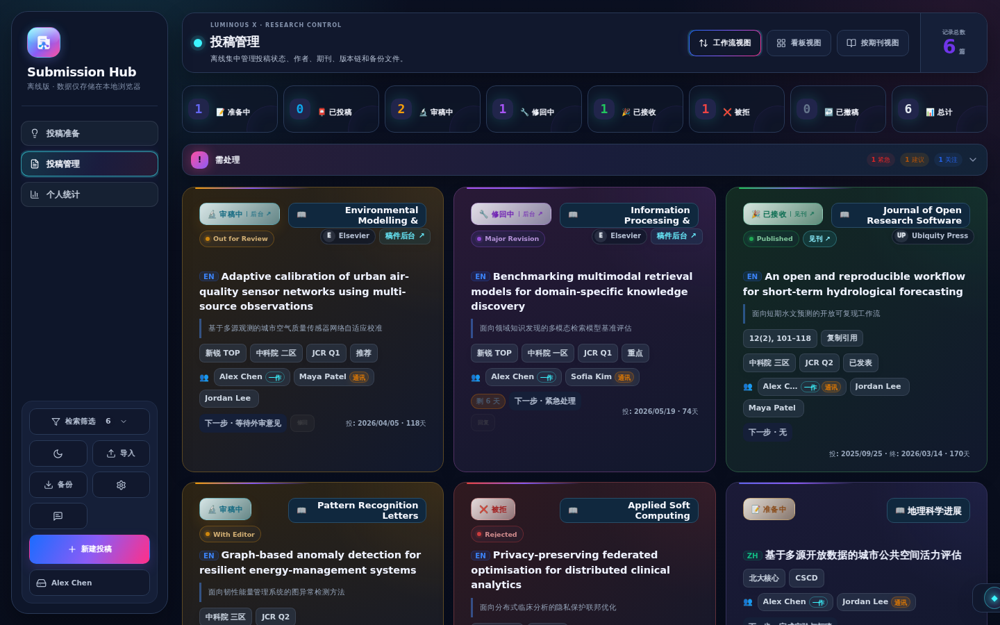
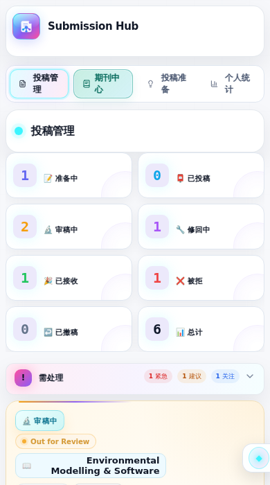

# Submission Hub

<p align="center">
  
</p>

<p align="center">
  
</p>

<p align="center">
  选题准备 · 期刊决策 · 科研组图 · 投稿跟踪 · 审稿修回 · 成果归档
</p>

<p align="center">
  <a href="https://qi-i.github.io/submission-hub/">🌐 在线使用</a> ·
  <a href="https://github.com/Qi-i/submission-hub/releases/tag/v2.0.1-offline-final">📦 最终离线版</a> ·
  <a href="docs/releases/v2.1.0.md">📋 v2.1.0 更新说明</a> ·
  <a href="https://github.com/Qi-i/submission-hub/issues/new/choose">🐛 问题与建议</a>
</p>

<p align="center">
  
  
  
  
</p>

当前版本：`v2.1.0`

## 项目定位

Submission Hub 是面向科研论文全流程的投稿管理工具，覆盖：

**研究选题 → 论文准备 → 期刊匹配 → 科研组图 → 投稿材料检查 → 正式投稿 → 审稿与修回 → 改投 → 录用与成果归档**

在线版使用 Supabase 进行账户、投稿、期刊、选题、草稿和附件数据同步，并通过 GitHub Pages 持续发布。

一级主菜单保持稳定：

**投稿管理 → 期刊中心 → 投稿准备 → 个人统计 → 后台管理**

`v2.1.0` 起，项目进入在线专用维护阶段。`v2.0.1-offline-final` 已冻结为最后一个单 HTML 离线版本；后续版本仅维护在线版，不再继续构建或更新离线 HTML。

## v2.1.0 重点

### 投稿准备重构

“投稿准备”调整为六个一级工作区：

**总览 → 论文准备 → 科研组图 → 投稿材料 → 期刊匹配 → 投稿前检查**

原有选题、草稿、期刊库和期刊比较能力继续保留，并归入相应一级工作区；科研组图不再作为边缘小卡片，而是直接进入独立专业工作区。

### 科研组图

FigMergeStudio 的核心工作流已重构为 Submission Hub 原生 React + TypeScript Figure Composer：

- 导入 PNG、JPG、WEBP、SVG、TIFF 和 PDF；
- 自动网格、4×4 等量化网格、自由拖拽和 A 大图 + B/C 非均匀布局；
- 每张图保留原始尺寸与宽高比，可锁定原比例或自由设置 X / Y / W / H；
- 支持 rowSpan / colSpan、图层顺序、多选、对齐、分布和拖拽吸附参考线；
- 自动子图标签，默认 `(a), (b), (c)` 与 Times New Roman；
- 标签字体、字号、字重、位置、颜色和偏移可调；
- 自由文本与移动；
- 出版尺寸预设以及 mm / cm / inch 与 DPI 换算；
- 导出 PNG、JPG、WEBP、TIFF、PDF 和 SVG，SVG 保持明确的比例语义；
- 组图工程可关联 Manuscript Draft，并同步 `figure_count`；
- 投稿前检查覆盖低分辨率、越界、重叠、非法拉伸和缺少图题/图注等问题；
- 图片本体默认保存在当前浏览器 IndexedDB，不自动上传 Supabase。

科研组图能力基于 MIT 许可的 `eliauk-hcy/figmerge-studio` 工作流重新实现，许可与归属见 [THIRD_PARTY_NOTICES.md](THIRD_PARTY_NOTICES.md)。

### 在线专用发布链

- 最终离线版本单独冻结，不覆盖既有 `v2.0.0` 标签；
- 移除持续离线构建、离线隔离检查和离线 Release 工作流；
- `npm run verify` 只验证当前在线应用；
- GitHub Release 发布在线构建快照；
- GitHub Pages 部署后必须通过 `build-info.json` 核对线上 SHA，只有 SHA 与合并提交一致才视为上线完成。

完整记录见 [docs/releases/v2.1.0.md](docs/releases/v2.1.0.md)。

## 核心功能

| 模块 | 主要能力 |
|---|---|
| 投稿准备 | 总览、论文准备、科研组图、投稿材料、期刊匹配、投稿前检查 |
| 科研组图 | 非均匀多图排版、原比例/自由尺寸、对齐分布、标签、文本、出版尺寸、预检与多格式导出 |
| 期刊中心 | 双语期刊资料、分区、收录、OA/APC、审稿信息、标签、备注和来源 |
| 期刊比较 | 并列比较质量、费用、速度、OA、收录和风险信息 |
| 投稿管理 | 工作流、看板和按期刊视图；主状态、后台原文、时间线和下一步 |
| 审稿分析 | 中英文状态归一化、返修轮次、阶段耗时、自定义时间线区间 |
| 私有附件 | 私有存储上传、预览、替换、删除及生命周期清理 |
| 成果归档 | DOI、见刊链接、卷期页码、引用格式、检索证明和见刊文件 |
| 账户与同步 | GitHub/邮箱账户、Luminous/Luminous X、亮/暗主题与多设备同步 |
| 数据备份 | 在线数据导入导出，并保持既有历史备份兼容逻辑 |

## 界面

Submission Hub 保留两套使用同一数据与业务逻辑的界面：

- **Luminous**：顶部导航，紧凑横向结构；
- **Luminous X**：固定侧栏，更强调工作流扫描与连续操作。

两套界面的页面语义、主菜单顺序和核心操作保持一致。

### Luminous





### Luminous X





### 暗色与移动端



<p align="center">
  
</p>

> 文档截图由自动视觉测试使用虚构数据生成，不应包含真实姓名、邮箱、论文题名、稿件编号、作者组合或附件内容。

## 使用

1. 打开 <https://qi-i.github.io/submission-hub/>。
2. 使用 GitHub 或邮箱登录。
3. 在投稿准备中管理论文准备、科研组图、投稿材料、期刊匹配和投稿前检查。
4. 点击一级“科研组图”，或投稿准备顶部快捷入口，进入 Figure Composer 专业工作区。
5. 正式投出后将稿件转入投稿管理，并持续维护后台原始状态、时间线、截止日期和附件。
6. 录用后补充 DOI、见刊链接、卷期页码和引用格式并完成成果归档。

## 最终离线版

最终离线版冻结在：[`v2.0.1-offline-final`](https://github.com/Qi-i/submission-hub/releases/tag/v2.0.1-offline-final)。

冻结源码为 `830cd645ee74f33ab41fd28e4bbafcd1fee31841`。Release 中的 `submission-hub-offline.html` 为最终受维护单 HTML，保留 localStorage、本地备份和离线核心工作流；它不会获得 `v2.1.0` 及之后的新功能。

## 本地开发

```bash
npm ci
npm run dev
```

完整验证：

```bash
npm run verify
```

当前 `verify` 包括发布元数据一致性、示例数据隐私、Figure Composer 迁移契约、在线专用维护契约、自动期刊档案、期刊字段与外显规则、附件生命周期、TypeScript 和在线生产构建。

## 在线部署

1. GitHub Actions 在 PR 上执行 Check、Verify Online Build、视觉检查和几何检查。
2. 合并到 `main` 后，Deploy to GitHub Pages 构建并发布在线站点。
3. `v2.1.0` 及后续版本由 Release Online Edition 创建 GitHub Release 和可部署 Web 快照。
4. 发布完成后读取线上 `build-info.json`，确认其中 SHA 与本次 `main` 合并 SHA 完全一致。

## 安全与隐私

- Supabase 密钥只通过部署环境变量和服务端 Secret 配置；
- EasyScholar 等服务密钥不得写入前端、README、测试、日志或示例数据；
- 示例数据与截图必须完全虚构；
- 每次发布必须通过隐私检查；
- Figure Composer 图片本体默认只保存在当前浏览器；PDF/TIFF 兼容组件仅在需要时按需加载。

## License

项目自身许可见仓库中的 License 文件；第三方组件与迁移来源见 [THIRD_PARTY_NOTICES.md](THIRD_PARTY_NOTICES.md)。
